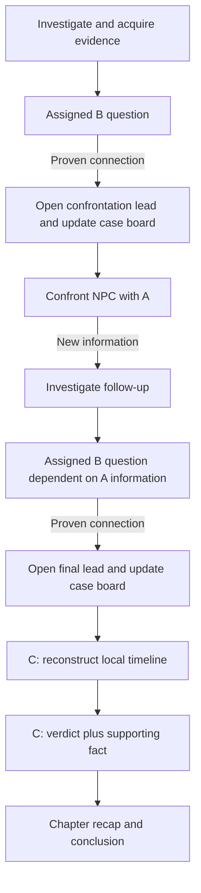

# Prototype Evaluation & Core Loop Specification

**Milestone:** 1.15

**Status:** Draft assembled from approved Phase 2 decisions

**Scope:** Research, evaluation, and vertical-slice design. This document does not implement production gameplay.

**Last updated:** 2026-09-20

## Status vocabulary

Every normative decision in this document uses one of these labels:

- **LOCKED FOR VERTICAL SLICE** — use this rule when building the first production-like chapter slice. It can still change after evidence from playtesting.
- **PROVISIONAL** — the current best design, suitable for the slice, but especially sensitive to tuning or weak evidence.
- **REQUIRES HUMAN PLAYTEST** — a hypothesis about player experience. Desk research, internal QA, telemetry, and the project owner's own playthrough cannot validate it on behalf of outside players.

These labels describe design confidence, not implementation status. A rule can be locked for the vertical slice while remaining unimplemented in the current debug prototypes.

---

## 1. Executive summary

The vertical slice will use all three prototypes in different narrative roles:

```text
Investigation
→ acquire and inspect evidence
→ mandatory B: connect clues to answer a chapter question
→ open an investigable lead and update the case board
→ mandatory A: confront an NPC with one decisive contradiction
→ recover new information
→ mandatory B: form a second deduction that depends on that information
→ continue investigation as needed
→ mandatory C: reconstruct the chapter's local event sequence
→ answer a final claim with a supporting fact
→ conclude the chapter
```

- **Prototype B — Clue Connection** is the frequent core deduction mechanic. A 20–40 minute chapter contains exactly two mandatory B deductions, plus at most one optional supplementary deduction. Each mandatory B is assigned by the chapter only after at least one complete proof path is available. **LOCKED FOR VERTICAL SLICE**
- **Prototype A — Statement Contradiction** is a compact confrontation mechanic. A chapter contains one required A encounter, normally after the first B gives the player a logical basis for confrontation. A uses one evidence item per refutation in the vertical slice. **LOCKED FOR VERTICAL SLICE**
- **Prototype C — Timeline Reconstruction** is the end-of-chapter synthesis. It appears once, reconstructs a local sequence of roughly six or seven events, then asks for a verdict plus a supporting fact. **LOCKED FOR VERTICAL SLICE** for role and frequency; **PROVISIONAL** for event counts.

The core anti-brute-force model is free experimentation followed by a meaningful formal commit. Draft edits, incomplete submissions, and duplicate failed equivalence classes cost nothing. A new failed formal commit consumes the local unit's failure budget. The current `3 failures → Assisted; 2 more → partner` threshold remains a **PROVISIONAL** baseline, not a market-validated value.

Guided, Assisted, and partner resolution never block the story or produce a worse ending. A partner explains the reasoning and resolves only the step where the player is stuck. The final recap shows the causal solution, not a score or rank. Help use remains available to save/history and opt-in local telemetry.

The central unresolved question is experiential: whether this sequence makes players feel that they formed and tested their own hypotheses. No published game, internal validator, or AI review can establish that for Alderford. It requires human playtesting.

---

## 2. Research methodology and limitations

### Project evidence reviewed

This evaluation uses the repository's actual implementation and contracts, not reports alone:

- Milestones 1.9/1.9.1: deduction and timeline evaluators, proof sets, validation, prototype cases;
- Milestone 1.10: Deduction Lab and local recorder;
- Milestone 1.11: Prototype A;
- Milestone 1.12: Prototype B and the long-content footer hardening;
- Milestone 1.13: Prototype C;
- Milestone 1.14 and hardening pass 1.14.1: resolution policy, meaningful commits, failure budgets, assistance, and partner resolution;
- Milestones 1.14.2A/1.14.2B on the current branch: evaluation summary, duplicate-attempt observability, and instrumentation audit;
- architecture, case, content, event, localization, save, and testing contracts;
- the project owner's direct playthrough of A/B/C and stated preference for B as the recurring mechanic, A at confrontational peaks, and C at chapter endings.

Milestone 1.14.1 is present in both implementation history and `docs/resolution-policy.md`; this specification does not rely on an unimplemented 1.14.1 design. Milestone 1.14.2 is present on the current feature branch rather than `main` at the time of writing.

### External evidence

Research combined:

- official feature descriptions;
- developer interviews and postmortems;
- professional reviews;
- player-review aggregates and substantive community discussions;
- comparisons with released deduction and narrative-investigation games.

Sources are used at three distinct levels:

1. **Source finding:** what a cited source directly reports about a game or its development.
2. **Cross-source pattern:** a recurring trade-off inferred across more than one game or source.
3. **Alderford inference:** a design choice made for this project. A comparable game can support the rationale but cannot validate the choice.

### Limitations

- There has been no controlled external playtest of this proposed combined loop.
- The project owner's playthrough is valuable first-party qualitative evidence, but one experienced stakeholder is not a representative player sample.
- The current A/B/C prototypes are isolated debug experiences over structurally related cases. They do not test investigation pacing, chapter integration, save continuity, or narrative consequences.
- Local telemetry describes actions, not internal understanding. It cannot directly measure agency, fairness, confusion, or an “aha” moment.
- Reviews have selection bias and describe shipped games with different audiences, content, and production values.
- Community discussions identify possible failure modes; a single post is never treated as a population-level result.
- Exact values in this document—failure thresholds, statement counts, clue counts, and event counts—remain tuning hypotheses unless explicitly marked otherwise.

Desk research narrows the design space. It does not replace human playtesting.

---

## 3. Source list and market patterns

### Primary and developer sources

| Source | Direct contribution to this evaluation |
|---|---|
| [Capcom: Ace Attorney Investigations — Logic](https://news.capcomusa.com/lets/browse/tgs-2009-ace-attorney-investigations-miles-edgeworth) | Official description of combining two pieces of gathered information to form a new realization. Supports B as a bridge from investigation to a new lead. |
| [Capcom: Ace Attorney Story Mode](https://news.capcomusa.com/2024/09/30/directors-testimony-behind-the-scenes/) | Official description of an accessibility mode that can advance deductions and choices. Supports assistance that preserves progression, not Alderford's exact hint ladder. |
| [Game Developer: Designing The Case of the Golden Idol](https://www.gamedeveloper.com/design/case-of-the-golden-idol) | Developer discussion of information presentation and player-driven reconstruction. |
| [Game Developer: Golden Idol and frequent testing](https://www.gamedeveloper.com/business/-the-case-of-the-golden-idol-i-used-frequent-testing-to-improve-its-mystery-solving) | Direct evidence that repeated testing was used to improve mystery clarity. Supports the requirement to test authored logic with people. |
| [Game Developer: Return of the Obra Dinn interview](https://www.gamedeveloper.com/business/road-to-the-igf-lucas-pope-s-i-return-of-the-obra-dinn-i-) | Developer account of building a deduction experience around inspecting evidence and resolving identities/fates. |
| [Game Developer: Paradise Killer design](https://www.gamedeveloper.com/design/inside-the-fantastic-murder-mystery-design-of-i-paradise-killer-i-) | Developer discussion of open investigation, player-chosen evidence gathering, and accusation structure. |
| [Game Developer: Heaven's Vault interview](https://www.gamedeveloper.com/business/road-to-the-igf-inkle-s-i-heaven-s-vault-i-) | Developer perspective on interpretation, uncertainty, and revisable understanding in narrative discovery. |
| [Game Developer: Socrates Jones postmortem](https://www.gamedeveloper.com/design/making-a-debate-game-the-design-challenges-of-socrates-jones) | Postmortem on converting argument into interactive challenge and the risk of rigid authored responses. |

### Reviews and player-facing sources

| Source | Direct contribution to this evaluation |
|---|---|
| [PC Gamer: Phoenix Wright: Ace Attorney Trilogy review](https://www.pcgamer.com/phoenix-wright-ace-attorney-trilogy-review/) | Professional assessment of testimony/evidence play, including the tension between dramatic breakthroughs and rigid answer matching. |
| [GameSpot: Trials and Tribulations review](https://www.gamespot.com/reviews/phoenix-wright-ace-attorney-trials-and-tribulation/1900-6181554/) | Professional review of courtroom pacing and evidence presentation. |
| [GameSpot: The Rise of the Golden Idol review](https://www.gamespot.com/reviews/the-rise-of-the-golden-idol-review-the-memory-remains/1900-6418317/) | Professional review of clue collection and solution construction in a recent deduction game. |
| [Indie Loupe: The Darkest Files review](https://www.indieloupe.com/reviews/the-darkest-files) | Review of interrogation, reconstruction, and the clarity/friction trade-off in a contemporary investigation game. |
| [The Darkest Files Steam discussion with developer response](https://steamcommunity.com/app/2058730/discussions/0/598522350980379667/) | A bounded community example of player feedback about reconstruction and developer explanation; used as an issue signal, not representative polling. |
| [Steam user reviews: The Case of the Golden Idol](https://store.steampowered.com/app/1677770/The_Case_of_the_Golden_Idol/#app_reviews_hash) | Broad player-review corpus consulted for recurring praise and frustration around self-directed deduction and answer construction; no individual comment is treated as representative. |
| [Steam user reviews: Return of the Obra Dinn](https://store.steampowered.com/app/653530/Return_of_the_Obra_Dinn/#app_reviews_hash) | Broad player-review corpus consulted for recurring reactions to delayed confirmation, notebook management, and large inference spaces. |

### Cross-source market patterns

The following are synthesized patterns rather than claims made by any one source:

1. **The strongest “aha” moments occur before input validation.** Players first reinterpret known information; the interface then lets them express that interpretation. A UI that exposes the answer space too narrowly can turn reasoning into enumeration.
2. **Contradiction mechanics create strong drama but are brittle.** Selecting the author's exact statement/evidence pair produces a clear climax. It also creates “I had the right idea” frustration when a nearby statement or supporting evidence is rejected. Ace Attorney reviews and argument-game postmortems repeatedly expose this trade-off.
3. **Connection mechanics support recurring play when they change the investigation.** The official *Ace Attorney Investigations* Logic description is a useful precedent: combining information produces a realization that moves the inquiry forward. A connection that only fills a notebook risks becoming checklist work.
4. **Delayed or coarse validation weakens brute-force oracles but needs recovery support.** *Obra Dinn* demonstrates the value of not confirming every individual inference immediately; its reception also shows that uncertainty and notebook friction can accumulate.
5. **Finite authored semantics are practical, but incompleteness feels unfair.** Golden Idol-style authored solution structures can preserve precise explanations. They require testing and multiple accepted paths where the fiction supports them.
6. **Hints preserve agency when they address the player's stuck step.** A leading question or recalled premise preserves more reasoning than selecting the answer. Full automation is still valuable as a fallback when clearly labeled and followed by an explanation.
7. **More items do not automatically produce deeper difficulty.** Larger evidence lists and longer testimony often increase search and memory burden instead of logical depth.
8. **A final reconstruction works best as synthesis.** If the player has already used the relevant facts, arranging events can consolidate understanding. If it introduces a new combinatorial search space at the end, it risks becoming an exhausting gate.

---

## 4. Prototype A evaluation — Statement Contradiction

### Intended role

One compact NPC confrontation per 20–40 minute chapter, after B has supplied a reason to challenge the witness. A turns established reasoning into drama; it is not the chapter's general-purpose deduction workspace. **LOCKED FOR VERTICAL SLICE**

### Rubric

Scores run from 1 (weak/high risk) to 5 (strong/low risk). For authoring cost, 5 means comparatively economical. Scores are provisional design judgments, not playtest results.

| Criterion | Score | Reasoning and evidence |
|---|---:|---|
| Epistemic agency | 4 | The player identifies a claim and supplies a fact, so the action can express reasoning. Agency falls if only one semantically arbitrary pair is accepted. Ace Attorney's strengths and rigid-answer frustrations support both sides of this assessment. |
| Aha potential | 4 | A contradiction creates a sharp before/after reinterpretation and a strong NPC response. It works best when B has already prepared the premise. |
| Brute-force resistance | 3 | A small statement × evidence matrix is enumerable. Free browsing, equivalence-class duplicate blocking, meaningful commits, and contextual consequences make enumeration unattractive but cannot make it impossible. |
| Feedback quality | 4 | The design distinguishes a correct contradiction, relevant-but-insufficient evidence, the right evidence on an adjacent statement, and unsupported accusation. This is stronger than binary rejection but authoring-intensive. |
| Fairness | 4 | Single-evidence refutation is legible when the fact directly conflicts with the selected statement. Fairness depends on testimony wording and accepting every logically sufficient evidence item. |
| Ambiguity tolerance | 3 | Finite alternate proof paths are supported, but the mechanic is inherently sensitive to statement boundaries and paraphrase. |
| Cognitive load | 4 | A compact 3–5 statement part and 5–7 evidence items bounds comparison. Long testimony or evidence text can still overload memory. |
| Interface friction | 4 | Select statement, inspect evidence, and present is direct. The fixed action footer and expandable text address the earlier off-screen Continue problem. |
| Narrative fit | 5 | Direct contradiction naturally supports confrontation, witness reaction, and a chapter peak. |
| Pacing and frequency | 3 | Strong once per chapter; repeated use would make every conversation adversarial and expose the pair-matching structure. |
| Authoring economy | 3 | Each statement needs wording, accepted proof paths, near-miss treatment, feedback, hints, and localized semantic review. |
| Scalability | 3 | The interaction scales across chapters if testimony remains short and contexts vary. More rounds or evidence are poor substitutes for deeper writing. |
| Accessibility and localization | 3 | Logical fairness depends on exact wording in both VI and EN. Expandable full text, persistent selection, and non-color cues are required. |
| Failure experience | 4 | Near-valid reasoning can be acknowledged without cost; unsupported accusations create recoverable pressure. The exact emotional effect remains untested. |

### Design rules

- Use **one required A encounter** per 20–40 minute chapter. **LOCKED FOR VERTICAL SLICE**
- Use **one or two short testimony parts**, each containing approximately **3–5 statements** and exposing approximately **5–7 evidence items**. Counts are **PROVISIONAL**.
- Each refutation uses **one evidence item**. If the logic genuinely requires several premises, the player forms them in B first and presents the resulting decisive fact in A. **LOCKED FOR VERTICAL SLICE**
- A statement can accept more than one evidence item when each independently and directly refutes it. The content contract must never preserve a single answer merely because it was authored first. **LOCKED FOR VERTICAL SLICE**
- An optional innocent lie may be present. It receives a valid contradiction response and can enrich characterization, but it does not satisfy the crime-relevant objective or hold mandatory progression. **LOCKED FOR VERTICAL SLICE**
- A contradiction unrelated to the current accusation must be explained as true but off-objective, not treated as nonsense.

### Feedback taxonomy

1. **Correct contradiction:** explain why the selected statement and evidence cannot both be true; trigger the authored NPC response and unlock the promised information.
2. **Relevant but insufficient:** acknowledge the shared topic, state what logical link is still missing, and do not consume credibility.
3. **Correct evidence, adjacent wrong statement:** acknowledge that the evidence matters, ask which exact assertion it contradicts, and do not consume credibility.
4. **Unsupported accusation:** the evidence does not establish a contradiction. This is a meaningful failed formal commit and may reduce local credibility or raise witness pressure.
5. **Duplicate failed pair or equivalent pair:** block it without cost and remind the player that the same reasoning was already rejected.

### Witness pressure and failure

- Witness pressure is a recoverable dialogue consequence: impatience, guarded wording, or temporary social resistance. It must not hide a clue required for progression. **LOCKED FOR VERTICAL SLICE**
- Local credibility remains **PROVISIONAL**. It represents the present confrontation, not the protagonist's global competence.
- At the provisional threshold, Guided and Assisted help become available; the encounter never ends in a hard game-over.
- Guided asks which part of the testimony conflicts with established facts.
- Assisted narrows the statement and recalls one acquired fact, but does not select the evidence.
- Partner resolution identifies the statement, presents the evidence, explains the contradiction, lets the NPC respond, restores the path forward, and records `resolved_by: partner`.

### Market evidence and project inference

- **Source finding:** Ace Attorney's released structure repeatedly uses statement/evidence presentation to create courtroom reversals; professional reviews also describe frustration when the expected presentation is overly specific ([PC Gamer](https://www.pcgamer.com/phoenix-wright-ace-attorney-trilogy-review/), [GameSpot](https://www.gamespot.com/reviews/phoenix-wright-ace-attorney-trials-and-tribulation/1900-6181554/)).
- **Cross-source pattern:** dramatic feedback makes contradiction suited to peaks, while rigid matching and repetition expose authorial rails.
- **Alderford inference:** keep A short, accept audited alternate refutations, and place multi-premise reasoning in B. This role assignment remains **REQUIRES HUMAN PLAYTEST** for felt drama and fairness.

---

## 5. Prototype B evaluation — Clue Connection

### Intended role

B is the recurring core mechanic. The chapter assigns a concrete investigation question after the player has acquired at least one complete proof path. The player can draft freely, then formally commit one deduction. A valid required deduction opens an investigable lead and updates the case board. Rare optional B deductions can enrich dialogue or understanding without gating the story. **LOCKED FOR VERTICAL SLICE**

This resembles the useful part of *Ace Attorney Investigations* Logic: combining known information creates a realization that changes what the investigator can pursue. The resemblance is a design reference, not validation of Alderford's execution ([Capcom](https://news.capcomusa.com/lets/browse/tgs-2009-ace-attorney-investigations-miles-edgeworth)).

### Rubric

| Criterion | Score | Reasoning and evidence |
|---|---:|---|
| Epistemic agency | 5 | Selecting a small proof set for a known question directly expresses a hypothesis. Agency depends on the question not revealing the relationship and on deductions changing the investigation. |
| Aha potential | 5 | Combining facts can produce the central realization before formal submission. Golden Idol's player-built explanations and AAI's Logic are strong market precedents for this shape. |
| Brute-force resistance | 3 | Two- or three-clue combinations are enumerable, especially in a small pool. Free drafting, one-at-a-time formal commits, equivalence blocking, coarse feedback, and consequences reduce the value of enumeration. |
| Feedback quality | 4 | Feedback can identify a missing logical step or premise without exposing an exact clue. Multiple proof paths complicate authored feedback. |
| Fairness | 4 | A chapter-assigned question and fully available proof path make the objective legible. Fairness fails if a clue is unavailable, unreadable, or rejected despite equivalent reasoning. |
| Ambiguity tolerance | 4 | Finite audited proof paths and per-path explanations support alternate reasoning. It is not an open semantic parser. |
| Cognitive load | 3 | Repeated clue comparison is the mechanic's main load. Progressive acquisition, pinning, compact summaries, and a question-scoped clue set are required. |
| Interface friction | 3 | Evidence inspection and slot management can become busy. Two or three slots, persistent drafts, and one commit at a time keep it bounded. |
| Narrative fit | 5 | A deduction that opens a location, topic, or action naturally links investigation phases. |
| Pacing and frequency | 5 | The interaction is brief enough for two mandatory uses when each has a distinct question and consequence. |
| Authoring economy | 2 | Fair recurring deductions require proof obligations, alternate paths, near misses, red herrings, hints, feedback, explanations, and dependency audits. |
| Scalability | 4 | A common interaction can support many chapters if question types, proof structure, and narrative consequences vary. |
| Accessibility and localization | 3 | Summaries must retain the same logical force in VI and EN. Large clue pools and drag-only slots would create barriers. |
| Failure experience | 4 | Drafting is free; formal rejection is coarse and recoverable; Guided/Assisted target the missing premise. The exact threshold remains untested. |

### Input structure

- Use **two clues** for early or direct deductions.
- Use **three clues** only when the third clue is an indispensable premise rather than padding. Three is the vertical-slice maximum. **LOCKED FOR VERTICAL SLICE**
- Slot count may vary by deduction between two and three; it does not vary during a single attempt.
- The player selects the clue set that answers the chapter's assigned question. The vertical slice does not add a relation dropdown, confidence selector, or separate premise field. **LOCKED FOR VERTICAL SLICE**
- Formal commit resolves **one deduction at a time**. The current debug Prototype B commits two drafts as an atomic batch; that behavior is evidence from Milestone 1.14, not the target production loop. Batch commit is deferred. **LOCKED FOR VERTICAL SLICE**

### Drafting and anti-dumping

- Drafting is freely revisable and produces no correctness signal.
- Incomplete drafts cannot be formally submitted and consume no attempt.
- The player cannot place more clues than the authored slot count.
- A valid proof set must be minimal for the authored obligation: no proper subset may already prove the same deduction.
- Adding every vaguely related clue is impossible because slots are bounded; content must not require irrelevant padding.
- A duplicate failed proof set, including an order-independent equivalent, is blocked without cost.

### Proof semantics

- The system uses finite, authored, order-independent proof sets. It does not claim to understand unrestricted natural-language reasoning.
- Every logically sufficient path found during authoring, review, internal testing, or later playtesting must be added or the wording/obligation must be narrowed.
- Different accepted proof paths may lead to the same deduction. Success feedback must explain the path the player actually used.
- “Relevant but insufficient” combinations receive specific near-miss treatment where practical.
- A clue that is correct but arrives before the full proof path remains available for drafting. The mandatory B task is assigned only when a complete path has been acquired.

### Evidence and deduction consequences

- A required B deduction immediately:
  1. becomes a proven node on the case board;
  2. records the supporting clue path;
  3. opens a concrete lead that can be investigated;
  4. may eliminate or weaken a hypothesis when authored to do so.
- It must do more than add a notebook sentence.
- Optional B can unlock additional dialogue, context, or characterization, but cannot hold a mandatory clue or ending.
- Clues are never consumed. Used clues remain readable, pinnable, and reusable when they support another question.
- The case board shows **proven connections only**. Private drafts stay in the active workspace and are not presented as facts.
- Future nodes remain hidden until authored discovery conditions reveal the question; the board must not leak the shape of the solution.

### Pool size and red herrings

- Evidence becomes available through investigation progress, not through answer-aware filtering.
- A B question uses a chapter-authored clue set drawn from already acquired evidence. The interface must preserve access to older clues and pinned items.
- No hard global evidence cap is locked. The vertical slice should keep the question-scoped pool compact enough to scan without relying on memory; the current debug pool of nine is an upper reference, not a validated target. **PROVISIONAL**
- Use few red herrings. Prefer clues that are useful elsewhere but insufficient for the current question, rather than meaningless decoys. **LOCKED FOR VERTICAL SLICE**
- Red-herring count and pool comfort are **REQUIRES HUMAN PLAYTEST**.

### Repetition across a chapter

B stays interesting by changing its reasoning job and consequence:

- **B1:** a direct two-clue connection that teaches the chapter's central question and opens the confrontation lead.
- **B2:** a two- or three-clue connection that depends on information recovered from A and opens the path to the final synthesis.
- **Optional B:** zero or one harder supplementary deduction with no mandatory reward.

Intermediate deductions become checklist work if the next action was already available. Each mandatory B must materially change the reachable investigation state.

### Market evidence and project inference

- **Source finding:** Capcom describes AAI Logic as combining gathered pieces of information to reach new conclusions ([Capcom](https://news.capcomusa.com/lets/browse/tgs-2009-ace-attorney-investigations-miles-edgeworth)). Golden Idol's developers describe designing around player reconstruction and using frequent tests to improve clarity ([design interview](https://www.gamedeveloper.com/design/case-of-the-golden-idol), [testing interview](https://www.gamedeveloper.com/business/-the-case-of-the-golden-idol-i-used-frequent-testing-to-improve-its-mystery-solving)).
- **Cross-source pattern:** clue connection best supports a core loop when it externalizes a realization and changes the investigation, but finite word/clue pools can invite enumeration.
- **Alderford inference:** chapter-assigned questions, bounded slots, free drafts, finite audited proof paths, and immediate lead unlocks provide the strongest current design. Whether two mandatory B tasks feel self-directed is **REQUIRES HUMAN PLAYTEST**.

---

## 6. Prototype C evaluation — Timeline Reconstruction

### Intended role

C is a chapter-end synthesis, not a general timeline editor and not a frequent minigame. It reconstructs a local event sequence using facts the player has already encountered, accepts every audited arrangement satisfying the evidence, then asks for a final claim plus a supporting fact. **LOCKED FOR VERTICAL SLICE**

### Rubric

| Criterion | Score | Reasoning and evidence |
|---|---:|---|
| Epistemic agency | 4 | A constraint-satisfying timeline lets players express a model of events. Agency drops when candidate slots expose a small permutation puzzle or facts are unfamiliar. |
| Aha potential | 5 | Seeing several events become one causal sequence can provide the chapter's strongest synthesis moment. |
| Brute-force resistance | 3 | Dragging events through finite slots is enumerable. Complete-placement commits, duplicate blocking, coarse feedback, and a local budget reduce oracle value. |
| Feedback quality | 4 | Broad relationship feedback preserves reasoning; on-demand Assisted can recall one acquired fact. Exact violated constraints shown automatically would reveal too much. |
| Fairness | 4 | Every required constraint must be available and readable. The game must accept uncertainty when evidence only establishes windows or order. |
| Ambiguity tolerance | 5 | Constraint evaluation naturally permits multiple timelines when the facts do not determine exact times. |
| Cognitive load | 3 | Six or seven events plus several facts is substantial at chapter end. Fixed anchors, short labels, and expandable sources are necessary. |
| Interface friction | 3 | Dragging and cross-referencing can be slow. Keyboard/controller alternatives and persistent fact access are required. |
| Narrative fit | 5 | Reconstructing “what happened” is a natural chapter climax after the relevant facts have been used elsewhere. |
| Pacing and frequency | 2 | One synthesis is strong; repeated timelines in the same short chapter would stall momentum. |
| Authoring economy | 2 | Authors must validate constraints, candidate domains, all accepted timelines, verdict consistency, hints, and per-path explanations. |
| Scalability | 3 | The form can recur once per chapter if event structures and narrative purposes vary and complexity remains bounded. |
| Accessibility and localization | 3 | Time notation, long facts, drag interactions, and spatial layouts need alternatives and localization review. |
| Failure experience | 4 | Free rearrangement plus broad formal feedback supports revision. Poorly chosen feedback could either expose the answer or leave the player directionless. |

### Structure

- Use approximately **6–7 events**, with approximately **2 fixed anchors** and the remainder movable. **PROVISIONAL**
- Use only the constraint types needed by the fiction: `fixed_time`, time `window`, `before/after`, `travel_time`, and `no_overlap`.
- Prefer order and windows over exact minutes. Require an exact time only when evidence establishes it.
- Accept any timeline satisfying all required facts. Do not require the author's preferred arrangement when several remain valid.
- A partial order is sufficient when the evidence leaves events underdetermined. The UI may visualize ranges or relative order rather than inventing false precision.
- Every required fact must be available before submission and linked back to its source.

### Two formal units

1. **Timeline unit:** free placement and rearrangement; one formal submission only when the timeline is complete.
2. **Final claim unit:** after an accepted timeline, the player chooses a verdict and one supporting fact. This has a fresh local failure budget.

The final claim tests whether the player understood what the timeline implies. It must not ask for a fact unrelated to the reconstructed constraint chain.

### Feedback

- Standard failed timeline feedback identifies a broad temporal relationship or constraint class to reconsider, not the exact violated source fact.
- Guided asks a Socratic question about the relevant temporal relationship.
- Assisted recalls one already opened fact but does not place an event.
- Standard failed claim feedback asks the player to reconsider the reasoning under the accepted timeline; it does not independently confirm the verdict or the chosen fact.
- Guided on the claim asks which established relationship bears on the statement.
- Assisted exposes one premise, but the player still selects the verdict and support.
- Partner resolution solves only the stuck unit. If the partner solves the timeline, the player still attempts the final claim with a fresh local budget. If the partner resolves the claim, the explanation must connect premise, timeline implication, and verdict.

### Preventing random placement

- Free movement gives no correctness signal.
- Incomplete timelines cannot be submitted.
- An order-independent duplicate placement is blocked without cost.
- Feedback becomes more specific only through player-requested help.
- The provisional meaningful-commit budget applies to the completed timeline, not each drag action.
- Candidate time slots must not encode a single exact answer when the evidence supports multiple arrangements.

### Completion role

C gates the chapter conclusion because it demonstrates synthesis, but every resolution path—including partner resolution—can complete the chapter and reach the same story progression. The recap explains the accepted causal sequence and final claim. **LOCKED FOR VERTICAL SLICE**

### Market evidence and project inference

- **Source finding:** Lucas Pope describes structuring *Return of the Obra Dinn* around discrete disasters, chronology versus discovery order, and a book that makes an out-of-order sequence understandable ([developer interview](https://www.gamedeveloper.com/business/road-to-the-igf-lucas-pope-s-i-return-of-the-obra-dinn-i-)). Golden Idol similarly asks players to synthesize observed details into a structured account ([developer interview](https://www.gamedeveloper.com/design/case-of-the-golden-idol)).
- **Cross-source pattern:** reconstruction is satisfying when it consolidates observations, accepts evidence-consistent ambiguity, and avoids acting as a rapid oracle.
- **Alderford inference:** one bounded, evidence-complete timeline plus a claim/support step is the best current climax. Its event count, cognitive load, and felt strength are **REQUIRES HUMAN PLAYTEST**.

---

## 7. Comparative scorecard

| Criterion | A | B | C |
|---|---:|---:|---:|
| Epistemic agency | 4 | 5 | 4 |
| Aha potential | 4 | 5 | 5 |
| Brute-force resistance | 3 | 3 | 3 |
| Feedback quality | 4 | 4 | 4 |
| Fairness | 4 | 4 | 4 |
| Ambiguity tolerance | 3 | 4 | 5 |
| Cognitive load | 4 | 3 | 3 |
| Interface friction | 4 | 3 | 3 |
| Narrative fit | 5 | 5 | 5 |
| Pacing and frequency | 3 | 5 | 2 |
| Authoring economy | 3 | 2 | 2 |
| Scalability | 3 | 4 | 3 |
| Accessibility/localization | 3 | 3 | 3 |
| Failure experience | 4 | 4 | 4 |
| **Total / 70** | **51** | **54** | **50** |

The totals are not a winner-selection formula. They expose different profiles: B is strongest for frequency and agency, A for dramatic focus and bounded interaction, and C for ambiguity-tolerant synthesis. All brute-force scores remain moderate because every mechanic operates over a finite authored space.

---

## 8. Final role of A, B, and C

| Mechanic | Final role | Frequency in a 20–40 minute chapter | Status |
|---|---|---:|---|
| B | Required reasoning bridge from evidence to an investigable lead; rare optional supplementary inference | Exactly 2 required; 0–1 optional | **LOCKED FOR VERTICAL SLICE** |
| A | Compact NPC confrontation applying a deduction to a decisive statement | Exactly 1 required encounter; 1–2 testimony parts | **LOCKED FOR VERTICAL SLICE** |
| C | End-of-chapter reconstruction and final claim check | Exactly 1 | **LOCKED FOR VERTICAL SLICE** |

The roles are locked for the slice, not declared universally correct for the complete game. Their combined feel is **REQUIRES HUMAN PLAYTEST**.

---

## 9. Core gameplay loop



An optional B branch can occur after the relevant evidence is acquired. It rejoins the main loop without holding a required clue or progression event.

Every mandatory deduction must change the player's available actions. A completed B that only records text fails the loop contract.

---

## 10. Chapter-level pacing

| Approximate phase | Mechanic | Purpose |
|---|---|---|
| Opening investigation | Evidence discovery | Establish people, locations, and the chapter question. |
| Early-middle | B1 | Teach or reinforce clue connection; open the confrontation lead. |
| Middle peak | A | Apply the reasoning under social pressure; obtain new information. |
| Late investigation | B2 | Combine A's information with physical/contextual evidence; open the final lead. |
| End | C timeline | Synthesize the local sequence. |
| End | C claim | State what the sequence proves and conclude the chapter. |

- Do not schedule A before the player has a reason to challenge the witness.
- B2 must genuinely depend on information from A, not unlock merely because time has passed.
- Do not use C to introduce a large set of unfamiliar facts.
- Optional B cannot interrupt the required cadence or create fear of missing the true route.
- The 20–40 minute duration is a planning envelope, not a validated completion target. **PROVISIONAL**

---

## 11. Experimentation versus formal commitment

### Free experimentation

The following are free and do not consume a failure:

- opening, rereading, pinning, filtering, or comparing clues;
- changing an A statement or evidence selection before presentation;
- adding, removing, or reordering B draft clues;
- moving C events;
- incomplete submissions rejected by the interface;
- repeating an already failed attempt or its normalized equivalence class;
- exploring a clue before its full proof path is available.

Free experimentation must not emit correctness feedback.

### Hypothesis formation

A player can keep private B drafts and tentative timeline arrangements. The case board shows only proven connections, so private hypotheses are not confused with established facts. Drafts persist through ordinary navigation and save/load.

### Formal accusation or commit

A formal action is explicit, complete, and narratively legible:

- **A:** present one selected evidence item against one selected statement;
- **B:** commit the complete clue set for one assigned question;
- **C timeline:** submit a complete placement;
- **C claim:** submit both verdict and supporting fact.

Only a new, complete, evaluator-graded incorrect formal action consumes the local failure budget. **LOCKED FOR VERTICAL SLICE**

---

## 12. Failure and retry policy

### What the attempt limit does

The attempt budget does not prevent brute force. In an offline single-player game, a player can enumerate, reload, or consult an external answer. The budget limits how many times the evaluator can be used as a rapid correctness oracle before the game switches to more explanatory help.

It therefore makes blind guessing slower and less informative; it does not turn guessing into a security violation.

**Source finding:** GameSpot's *Trials and Tribulations* review explicitly observes that unrestricted save/reload makes courtroom penalties ineffective, while also reducing frustration when the expected evidence is unclear ([GameSpot](https://www.gamespot.com/reviews/phoenix-wright-ace-attorney-trials-and-tribulation/1900-6181554/)). **Alderford inference:** use the local budget to change the quality of help, not to enforce punishment or protect a score.

### Unit scope

- A: each testimony part is one local unit.
- B: each individual deduction is one local unit.
- C: the timeline and final claim are separate local units.
- Chapter-wide totals are telemetry only.

### Baseline

```text
0–2 failed meaningful formal commits: Standard
3rd failed commit: offer/require acknowledgement of Assisted help
2 further failed commits: offer partner resolution
```

This `3 + 2` baseline is **PROVISIONAL** and **REQUIRES HUMAN PLAYTEST**. Published games support escalation and fallback in principle, not these numbers.

### Rules

- Duplicate equivalence classes do not count.
- Invalid or incomplete input does not count.
- A valid optional contradiction or alternate proof path does not count as failure.
- Success resolves the unit and resets only the next unit's local budget.
- Help already used remains recorded for the run but does not make a new unit start partially exhausted.
- There is no hard game-over for deduction failure.
- Quit/load must restore the active unit's budget, failed equivalence classes, and help state. Explicit Restart or New Game starts a new run.
- Restart-based budget avoidance is not a serious integrity problem for a single-player game. It should be observable in local telemetry and should not justify hostile save restrictions.

### Resolution attribution

`Independent`, `Guided`, and `Assisted` describe help the player actually used, not the number of failed commits:

- **Independent:** no Guided hint, Assisted premise, or partner resolution used;
- **Guided:** at least one Guided hint used, but no Assisted premise or partner resolution used;
- **Assisted:** an Assisted premise or partner resolution used.

Failed-commit counts remain separate budget and telemetry data. Merely making one or two mistakes does not relabel the player's solution. These labels may appear in internal history or a detailed case record, but not as a public chapter grade. **LOCKED FOR VERTICAL SLICE**

---

## 13. Hint escalation policy

Hints are available from the beginning and are always player-triggered. A failed formal commit may softly remind the player that help exists, but never auto-reveal a hint.

**Source finding:** GameSpot's *Rise of the Golden Idol* review describes a player-invoked ladder that can ask a leading question, provide further guidance, or give a direct hint, while also noting that some trial-and-error and brute force remain possible ([GameSpot](https://www.gamespot.com/reviews/the-rise-of-the-golden-idol-review-the-memory-remains/1900-6418317/)). **Alderford inference:** retain player control over escalation and adapt the content of help to A, B, or C.

### Prototype B

1. **Guided:** ask a leading question about the missing logical step.
2. **Guided follow-up:** name the type of information that should be compared, not an exact clue.
3. **Assisted:** surface one acquired premise relevant to at least one still-valid proof path; the player completes the connection.
4. **Partner:** connect one accepted path and explain the role of every clue, the deduction, and the resulting lead.

Assistance must account for multiple accepted proof paths and should avoid steering a player away from a valid draft merely because a different path was authored first.

### Prototype A

1. **Guided:** ask which part of the testimony conflicts with established facts.
2. **Assisted:** narrow the statement and recall one observed fact, without selecting evidence.
3. **Partner:** identify statement and evidence, explain the contradiction, and let the NPC's response play.

### Prototype C

1. **Guided:** ask about the relevant temporal relationship or constraint class.
2. **Assisted:** recall one already opened fact, without moving an event or selecting the verdict.
3. **Partner:** resolve only the stuck unit and explain the constraint chain.

Mechanic-specific hints are **LOCKED FOR VERTICAL SLICE**. Exact wording and escalation timing are **REQUIRES HUMAN PLAYTEST**.

---

## 14. Partner-resolution rules

Partner resolution is a teaching fallback, not a skip animation.

Every partner explanation must state:

1. the question or disputed claim;
2. the relevant facts;
3. the relationship between them;
4. the resulting deduction or placement;
5. the concrete lead, response, or conclusion that follows.

Additional mechanic rules:

- **A:** show the statement, evidence, contradiction, NPC response, and recovered mandatory information. Optional innocent lies remain player-only.
- **B:** explain each clue's role, form the deduction, update the board, and open the lead.
- **C:** solve only timeline or claim, whichever is stuck. A partner-solved timeline still leads to an independent player attempt at the claim.

Partner use records `resolved_by: partner`. It never changes the ending, blocks chapter completion, or withholds rewards required for later chapters. **LOCKED FOR VERTICAL SLICE**

**Source finding:** Capcom's Story Mode can automatically solve Logic and Confrontation sections so the story continues ([Capcom](https://news.capcomusa.com/2024/09/30/directors-testimony-behind-the-scenes/)). **Alderford inference:** a step-scoped partner explanation is preferable to full automation for ordinary recovery, while preserving the same principle that assistance must not block narrative access.

---

## 15. Brute-force mitigation by mechanic

### Selected and rejected/deferred methods

| Method | Brute-force effect | Friction / exam risk | Cost | Fit and vertical-slice decision |
|---|---|---|---|---|
| Local failed-commit budget | Medium; limits oracle calls rather than combinations | Low if drafts stay free; high if ordinary exploration counts | Low–medium implementation | Apply to A/B/C; `3 + 2` threshold **PROVISIONAL** |
| Recoverable narrative consequence | Medium for A; makes accusation meaningful | Low when reversible; can intimidate cautious players | Medium authoring | Apply to A as witness pressure; never withhold mandatory evidence |
| Relation picker (`supports/refutes/explains/rules out`) | Medium; asks player to express semantics | Medium–high; can feel like a logic exam and add UI steps | Medium | Do not add to vertical-slice B; relation remains authored by the question |
| Choose the question being solved | Medium | Medium; can produce target-selection confusion | Medium | Chapter assigns mandatory B questions; defer free-form question selection |
| Confidence locking | Low–medium | High; encourages metagaming confidence | Medium | Defer |
| Staged commitment | High value: drafting is free, validation is deliberate | Low | Medium | Apply to A/B/C |
| Hypothesis board | Indirect; supports planning rather than blocking guesses | Medium UI and save burden | High | Defer beyond proven-node case board and private drafts |
| Required supporting premise | Medium–high | Medium; valuable when narratively natural | Medium–high authoring | Apply to C's verdict; B's clue set already carries premises; do not add another field |
| Delayed feedback | Medium–high; weakens the oracle | Can create uncertainty and delayed frustration | Medium | Use only within C's complete-timeline submission; do not delay chapter feedback globally |
| Partial validation | Medium if coarse; low if it names exact wrong slots | Low–medium | High authoring | Use broad relationship feedback; exact source only through requested assistance |
| Contradiction heat / witness pressure | Medium for A | Emotional pressure may suppress reasonable experiments | Medium–high | Apply recoverably to A; **REQUIRES HUMAN PLAYTEST** |
| Non-progression score | Low | Can cause reload/restart pressure | Low | Store telemetry; no public rank or completion grade |
| Adaptive hint ladder | Indirect; replaces repeated guessing with teaching | Low when player-triggered | High authoring | Apply mechanic-specific Guided/Assisted/partner escalation |
| Evidence relevance filtering | Medium but risks revealing the answer | Can make selection easier than reasoning | Medium | Filter by investigation state and assigned question, never by hidden correctness |
| Require every clue to be opened before commit | Low | Feels procedural; opening does not prove understanding | Low | Do not require globally; assign mandatory B only when a proof path is available |
| Block equivalent resubmissions | Medium against repeated probing | Very low if normalization is fair | Medium | Apply to A/B/C |
| Accept multiple proof paths | Reduces false rejection, not brute force | Low | High authoring/test cost | Required whenever fiction permits |

### Mechanic summary

- **A:** bounded statement/evidence space, semantic near-miss handling, duplicate blocking, recoverable witness pressure, local commit budget.
- **B:** bounded 2–3 clue slots, free non-oracular drafts, single-deduction commits, minimal proof sets, duplicate blocking, few useful-elsewhere red herrings, multiple accepted paths.
- **C:** free placement, complete-placement commits, broad feedback, duplicate blocking, constraints that accept alternate timelines, separate claim unit.

---

## 16. Multiple-solution policy

The vertical slice accepts a finite set of authored and audited solution paths. **LOCKED FOR VERTICAL SLICE**

- **A:** accept every authored single-evidence item that directly refutes the selected statement. Treat adjacent-statement and relevant-insufficient cases explicitly.
- **B:** accept every minimal proof set that satisfies the same proof obligation. Order does not matter. Each accepted path has an explanation based on the submitted clues.
- **C:** accept every complete timeline satisfying required constraints. Exact authored minutes are not privileged when windows/order are all the evidence supports.
- The validator proves internal consistency and enumerates bounded domains where practical. It cannot prove that authors anticipated every human interpretation.
- When playtesting reveals a logically valid rejected path, add it, narrow the wording, or revise the evidence. Do not dismiss it solely because it differs from the first authored answer.

Natural-language semantic equivalence remains out of scope for the slice. The content contract must be honest about finite authored acceptance.

---

## 17. Evidence and deduction graph rules

- Evidence is acquired through investigation and remains reusable.
- A mandatory B question is revealed only when at least one complete proof path is available.
- A valid mandatory B creates a proven deduction node and opens a concrete investigation lead.
- A valid A confrontation consumes no evidence; it changes conversation/progression state and supplies new information.
- B2 must use at least one premise or clue made available by A's outcome.
- C draws from events and facts already encountered in the chapter.
- Only proven nodes and their actual accepted support paths appear as facts on the case board.
- Draft connections remain local to the workspace.
- Hidden future nodes cannot reveal the number or shape of remaining deductions.
- An optional deduction cannot be a dependency for required progression.
- Red herrings should normally have a real use elsewhere or support a reasonable but insufficient inference.
- Derived deduction depth should remain shallow enough to explain in recap. The existing foundation's depth rules remain the implementation baseline until production integration is designed.

---

## 18. Content-authoring constraints

Every required A, B, and C unit needs a **reasoning dossier** reviewed independently of the puzzle author.

### Required dossier fields

1. Narrative purpose and chapter question.
2. Proof obligation stated in plain language.
3. Information guaranteed available at assignment.
4. All accepted proof paths or accepted constraint classes.
5. Minimality justification for each path.
6. Known near-valid and insufficient paths.
7. Red herrings and their legitimate purpose elsewhere.
8. Standard failure feedback.
9. Guided prompt.
10. Assisted premise.
11. Partner explanation.
12. Per-path success explanation.
13. Lead/state unlocked on success.
14. VI/EN semantic-equivalence review.
15. Telemetry unit id and equivalence normalization rule.

### A-specific constraints

- 3–5 statements and 5–7 evidence items per part are the provisional target.
- One evidence item must be logically sufficient for each accepted refutation.
- Test statement boundaries for adjacent-answer ambiguity.
- Optional innocent lies need a full response but no mandatory dependency.

### B-specific constraints

- Slot count is two or three and matches at least one minimal proof set.
- No proper subset can satisfy the same obligation.
- Author every known alternate proof path and path-specific explanation.
- Each mandatory deduction opens a distinct, inspectable lead.
- B2's dependency on A must be causal and validated, not a time gate.

### C-specific constraints

- Every required constraint is visible through an acquired fact.
- Enumerate or otherwise audit all accepted timelines within the bounded candidate domain.
- The final claim must hold consistently across every accepted timeline.
- Exact-time claims require exact-time evidence.
- Fixed anchors, time windows, travel, ordering, and overlap rules must be narratively sourced.

### Review rule

When possible, the logic reviewer must not be the original puzzle author. Automated validation checks references and formal consistency; it is not a fairness test and does not replace human review or playtesting.

---

## 19. Difficulty curve

Difficulty increases through reasoning depth, not through uncontrolled list growth. **PROVISIONAL**

### Within the vertical-slice chapter

- **B1:** two clues, direct question, relatively visible relationship.
- **A:** medium difficulty; one decisive evidence item among a compact set; one or two plausible near misses.
- **B2:** two or three clues, with one premise obtained through A; greater inferential distance rather than a larger interface.
- **C:** synthesis of six or seven known events using a small mix of constraint types; hardest in integration, not in hidden information.

### Across later chapters

Increase difficulty by:

- making causal relationships less direct;
- combining independently understood premises;
- adding a limited number of alternate proof paths and meaningful near misses;
- asking the player to distinguish opportunity from exclusive access, cause from correlation, or possible from necessary;
- varying narrative consequences and evidence provenance.

Do not primarily increase difficulty by adding more statements, more clues, more timeline events, longer prose, or smaller exact-time increments.

---

## 20. UI/UX principles

- Show a short neutral fact summary first; provide full source text on demand.
- Preserve the source and context of every clue or timeline fact.
- Let players pin evidence and keep older evidence reopenable.
- Keep the current question visible while inspecting clues.
- Keep the main formal action in a fixed, reachable footer. Long content must never push Continue/Commit outside the viewport.
- Preserve drafts when switching clues, screens, or save/load.
- Use text/icon/state changes in addition to color.
- Keep keyboard/controller focus visible and deterministic.
- Provide a non-drag alternative for C, such as selecting an event and then a slot/order position.
- Distinguish draft, proven, assisted, and partner-resolved states without framing help as failure.
- Do not expose internal ids, raw evaluator categories, hidden proof counts, or future case-board topology.
- Never use UI filtering based on which clue is secretly correct.

---

## 21. Accessibility and localization constraints

- VI and EN must preserve the same proof obligation, certainty, temporal relation, negation, exclusivity, and scope.
- A translation that makes an inference stronger or weaker is a content defect even when grammatically correct.
- Evidence summaries should be short; full detail remains available without losing selection state.
- Test long strings, font scaling, and narrow windows against fixed action controls.
- Do not rely on color alone for relevance, correctness, witness pressure, fixed events, or selected state.
- All drag interactions need click/select and keyboard/controller alternatives.
- Time facts need locale-readable wording while internal comparison remains unambiguous.
- Hint text should use plain language and one logical step at a time.
- The case board and timeline need predictable focus order and readable labels for assistive navigation.
- Animation, pressure effects, and NPC reactions must not obscure text or prevent review.

The exact comprehension and text-density limits in both languages are **REQUIRES HUMAN PLAYTEST**.

---

## 22. Save-state requirements

Production save/load must restore the exact deduction state the player was working in. **LOCKED FOR VERTICAL SLICE**

Persist at minimum:

- active chapter, mechanic, unit, and question;
- acquired/opened/read/pinned clue state;
- A selected statement/evidence, resolved statements, local witness pressure, and optional-lie state;
- B draft clue sets, proven deductions, actual proof path, opened leads, and case-board state;
- C event placements, fixed anchors, opened facts, accepted timeline, claim selections, and unit transition;
- normalized failed equivalence classes per local unit;
- current local failures and phase;
- hints requested, assistance accepted, and partner availability/use;
- `resolved_by` attribution per resolved unit;
- run-level help history for telemetry/history, without using it as a public grade;
- elapsed-time anchors only if they can be restored without corrupting duration metrics.

A formal commit and its resulting state change must be persisted atomically before player-facing success/failure feedback can be lost to a quit or crash. Loading must not re-emit gameplay or telemetry transitions as if they just occurred.

Explicit Restart/New Game begins a new run. Ordinary quit/load does not restore attempt budget or erase prior failed equivalence classes.

---

## 23. Telemetry event requirements

Telemetry remains local, opt-in, identity-free, and manually exportable for the vertical slice. It is an evaluation instrument, not production analytics. **LOCKED FOR VERTICAL SLICE**

### Event groups

- session/run started, resumed, restarted, completed, or abandoned;
- chapter/unit/question entered;
- clue acquired, opened/read, pinned/unpinned;
- draft clue added, removed, replaced, or reordered;
- timeline event selected, placed, moved, or removed;
- formal commit started, succeeded, or failed;
- normalized unique candidate and duplicate-equivalence block;
- feedback category shown;
- hint opened by level and mechanic;
- assistance offered/accepted;
- partner resolution offered/used;
- deduction proven, case-board connection added, lead opened;
- save and load during an active unit;
- unit and chapter duration anchors.

### Data rules

- Record stable content ids, sequence, state category, elapsed time, and counts.
- Do not record free-form player text, personal identity, machine identity, or network identifiers.
- Version the envelope and event vocabulary separately.
- Normalize candidate identity exactly as the evaluator/controller does so reordered equivalent attempts do not inflate uniqueness.
- Preserve current 1.14.2 duplicate-block observability.
- Treat telemetry as behavioral evidence only. “Few attempts” can mean insight, an obvious puzzle, accidental success, or prior knowledge.

### Human measures that telemetry cannot replace

- explanation in the player's own words;
- perceived fairness;
- sense of agency;
- strength and location of the “aha” moment;
- frustration and confidence;
- whether help felt supportive or as if the game solved the puzzle.

---

## 24. Definition of chapter completion

A chapter completes when all mandatory nodes have resolved:

```text
B1 resolved
AND A resolved
AND B2 resolved
AND C timeline resolved
AND C verdict + supporting fact resolved
```

Resolution by player, Guided/Assisted play, or partner all satisfy the node. They produce the same story progression and ending. **LOCKED FOR VERTICAL SLICE**

The chapter recap:

- explains the causal chain and accepted proof paths;
- shows what the timeline established and why the final claim follows;
- does not display a score, rank, or Independent/Assisted badge;
- may retain neutral per-step provenance in detailed case history;
- never asks the player to replay for canonical completion.

This avoids turning accessibility/help use into a lesser ending. Whether the recap still feels earned after partner resolution is **REQUIRES HUMAN PLAYTEST**.

---

## 25. Vertical-slice acceptance criteria

### Implementation and content acceptance — LOCKED FOR VERTICAL SLICE

- The chapter implements the required `B1 → A → B2 → C` sequence.
- Exactly two mandatory B deductions, one A encounter, and one C reconstruction are present.
- Each mandatory unit has a complete reasoning dossier and independent logic review.
- Every declared proof path and accepted timeline is completable.
- B1 and B2 each open a concrete, investigable lead.
- B2 genuinely depends on information obtained through A.
- Guided, Assisted, and partner paths cannot block progression.
- A witness pressure never withholds mandatory evidence.
- Save/load restores exact active deduction state.
- Duplicate equivalence classes are recognized and cost nothing.
- Local opt-in telemetry records the required event sequence and exports it.
- VI/EN content is reviewed for logical equivalence.
- Long text and enlarged UI do not hide formal actions.
- C is usable without drag-only input.
- Chapter completion and recap work identically for every resolution path.

### Experience evaluation — REQUIRES HUMAN PLAYTEST

The following are not pass/fail implementation criteria until a player baseline exists:

- completion time;
- solve rate without help;
- number of formal commits;
- hint/partner-use rate;
- perceived difficulty;
- perceived fairness;
- agency and “aha” scores;
- desire to continue.

The first human test establishes a baseline rather than proving success through arbitrary numeric thresholds. Qualitative explanation and fairness failures take priority over speed.

---

## 26. Deferred ideas

- Free-form player-created investigation questions.
- Relation dropdowns for B.
- Confidence locking or wagering.
- A fully editable hypothesis graph.
- Public completion ranks, scores, medals, or rewards for avoiding help.
- Batch theory commit across multiple B deductions.
- Multi-evidence A refutations.
- Unbounded clue pools or unrestricted semantic parsing.
- A general free-form timeline editor.
- Exact-minute timelines without exact-time evidence.
- Network analytics or automatic upload.
- Adaptive difficulty based on opaque player profiling.
- Mandatory replay after partner resolution.

Deferred means “not justified for the vertical slice,” not permanently rejected.

---

## 27. Risks

| Risk | Impact | Current mitigation | Evidence status |
|---|---|---|---|
| Mandatory B feels like assigned homework | Core mechanic loses agency | Questions arise from investigation; free drafts; each B opens a lead | **REQUIRES HUMAN PLAYTEST** |
| Players brute-force finite combinations | Evaluator becomes an oracle | Bounded meaningful commits, duplicate blocking, coarse feedback, few red herrings | Threshold **PROVISIONAL** |
| Valid reasoning is rejected | Severe fairness loss | Finite multiple paths, reasoning dossiers, independent review, near-miss handling | Coverage **REQUIRES HUMAN PLAYTEST** |
| Failure budgets suppress reasonable experimentation | Players become cautious or reload | Drafting is free; only new complete formal failures count; no public grade | **REQUIRES HUMAN PLAYTEST** |
| Witness pressure feels punitive | A loses dramatic appeal | Recoverable dialogue only; no mandatory clue loss | **REQUIRES HUMAN PLAYTEST** |
| C becomes drag-and-check enumeration | Weak climax | Complete commits, broad feedback, alternate timelines, known facts | **REQUIRES HUMAN PLAYTEST** |
| C overloads players at chapter end | Fatigue and abandonment | Six–seven events, fixed anchors, short summaries, source access | Count **PROVISIONAL** |
| Hints solve too much | Lost agency/aha | Socratic Guided, one-premise Assisted, step-scoped partner | **REQUIRES HUMAN PLAYTEST** |
| Partner completion feels unearned | Weak conclusion | Mandatory explanation and recap; player continues at next unit | **REQUIRES HUMAN PLAYTEST** |
| Localization changes logical force | False ambiguity or unfair rejection | Bilingual semantic review in every dossier | Requires bilingual human review |
| Authoring cost grows unsustainably | Fewer or weaker chapters | Strict counts, shallow graph, reusable dossier/validation | **PROVISIONAL** |
| Debug architecture is mistaken for production design | Save/progression mismatch | Explicit implementation-baseline section and production contracts | Known project risk |

---

## 28. Unvalidated hypotheses requiring future human playtest

### Priority 1 — may change the core loop

1. Two mandatory B deductions per chapter still feel like player reasoning rather than checklist completion.
2. Free draft plus formal commit discourages brute force without discouraging legitimate hypothesis testing.
3. The `3 + 2` failed-commit baseline gives help at the right time.
4. Audited proof paths cover the reasonable interpretations players actually form.
5. Guided and Assisted help resolve the stuck step without removing the “aha.”
6. A six- or seven-event C is strong enough for a climax and resistant to random placement.

### Priority 2 — pacing and emotion

7. `B1 → A → B2 → C` fits comfortably in 20–40 minutes.
8. A with 3–5 statements, 5–7 evidence items, and one-evidence refutation is challenging but fair.
9. Recoverable witness pressure creates tension without making players afraid to try.
10. B2 feels harder than B1 because of inferential depth, not obscurity.
11. Partner explanations leave players able to restate the reasoning.
12. Removing public grades reduces reload pressure without weakening accomplishment.

### Priority 3 — usability and comprehension

13. Short summaries plus expandable sources reduce text overload without hiding decisive nuance.
14. A progressively acquired, question-scoped clue pool remains manageable across input methods.
15. C's non-drag interaction is understandable and efficient.
16. VI and EN produce equivalent interpretations of every required inference.
17. Players understand that optional B enriches the case and is not required progression.

### Minimum future test evidence

For each hypothesis, combine action logs with observation and a short post-unit interview. At minimum ask the player to explain the solution in their own words, identify when the relationship became clear, and describe any rejected attempt they still consider valid. Do not infer understanding from completion alone.

---

## Implementation baseline versus target specification

The current repository is a valid research foundation but not yet the production loop described here:

| Area | Current implementation | Target defined here |
|---|---|---|
| Integration | A/B/C are debug-only, launched through Deduction Lab | Chapter-integrated `B1 → A → B2 → C` |
| B commit | Two drafts committed as one atomic batch | One deduction committed at a time; success immediately opens a lead |
| Evidence availability | Prototype B's nine-item pool is available from the start | Evidence appears through investigation; assigned question has at least one complete available path |
| Case board | No production proven-connection board | Show proven connections and actual proof path only |
| Save | Deduction prototype state is not in production save | Restore exact active unit, drafts, placements, budgets, help, and equivalence classes |
| Telemetry | Debug-only local recorder and 1.14.2 summary | Local opt-in chapter sequence with versioned events; still no network analytics |
| Completion result | Current debug presenter can expose run resolution result | No public chapter score/rank; keep provenance in history/save/telemetry |
| Resolution attribution | Current 1.14 policy can escalate its run result from failed commits alone | Independent/Guided/Assisted records help actually used; failures remain separate data |

This table is descriptive. Milestone 1.15 does not authorize implementation of these differences.
